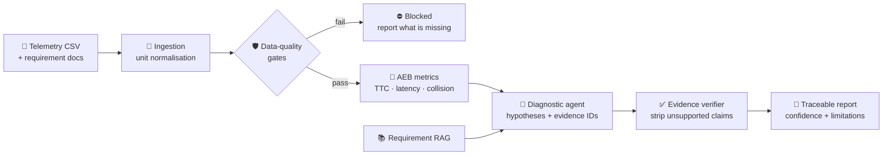

<div align="center">

# 🚗 ADAS Intelligence Platform (AIP)

**Turn raw ADAS telemetry and engineering knowledge into traceable, measurable and explainable validation intelligence.**

An evidence-first AI workbench for diagnosing Advanced Driver-Assistance System behaviour.
Every claim it makes points back to a timestamped signal, a computed metric or a cited requirement.
No evidence, no claim.

[](https://www.python.org/)
[](https://mypy.readthedocs.io/)
[](https://docs.astral.sh/ruff/)
[](https://github.com/ChandrashekarHL/ADAS-Intelligence-Platform-/actions/workflows/ci.yml)
[](https://docs.pydantic.dev/)
[](#-roadmap)

[Why AIP](#-why-aip) •
[How it works](#-how-it-works) •
[Quickstart](#-quickstart) •
[Demo data](#-the-aeb-late-braking-demo) •
[Architecture](#-architecture) •
[Roadmap](#-roadmap) •
[Safety](#-safety-and-limitations)

</div>

---

## 📌 Why AIP

ADAS validation teams drown in data: CAN traces, perception logs, requirement documents,
simulation output, issue history. When an Automatic Emergency Braking (AEB) event goes
wrong, answering *"why did the car brake late?"* means hours of manual cross-referencing
across all of them.

Large language models can read all of that in seconds. They also hallucinate root causes.
In a safety-relevant domain that is worse than useless.

**AIP is built around one rule: the AI may only say what the evidence supports.**

| Traditional log analysis | Naive "chat with your logs" | **AIP** |
|---|---|---|
| Manual, slow, expert-only | Fast, but unverifiable | Fast **and** verifiable |
| Findings live in someone's head | Findings may be invented | Every finding cites an evidence ID |
| No confidence statement | Always sounds confident | Confidence is computed from evidence quality |
| Data quality issues found late | Data quality issues ignored | Quality gates run **before** any analysis |

> AIP is an engineering-assistance tool. It is **not** a self-driving stack, not a perception
> model, and not a safety-certification tool. See [Safety and limitations](#-safety-and-limitations).

---

## 🔍 How it works



1. **Ingest.** Telemetry CSV is parsed, timestamps are checked for continuity, and units
   are converted to SI exactly once at the boundary.
2. **Gate.** Required signals, timestamp continuity, unit consistency and evidence
   sufficiency are checked. A failure blocks analysis or downgrades confidence. It is never
   silently ignored.
3. **Measure.** Events are detected on the logged signals, a T−5 s..T+5 s window is cut
   around the brake command, and pure functions compute the AEB metrics inside it:
   time-to-collision (TTC), braking latency, confidence dropout during the risk phase,
   minimum gap, maximum deceleration, jerk, collision. Each value carries its own
   evidence ID, timestamp, window and method. A metric that cannot be computed says why.
4. **Diagnose.** An LLM agent receives only the evidence windows, metrics and retrieved
   requirement chunks. It must answer in a fixed JSON schema and may cite only the evidence
   IDs it was handed.
5. **Verify.** Every cited ID is resolved. Anything unresolvable is removed or marked
   unsupported. Confidence is capped by evidence quality.
6. **Report.** A report with a timeline, metrics table, ranked hypotheses, missing
   evidence, recommended next tests, limitations and a mandatory disclaimer.

### The evidence contract

Every traceable artifact receives a stable ID at creation time (`window_…`, `metric_…`,
`chunk_…`, `event_…`, `scenario_…`). Agents emit this schema and nothing else:

```json
{
  "observations": ["..."],
  "hypotheses": [
    { "cause": "...", "evidence_ids": ["metric_3f9a…", "window_c21e…"], "confidence": 0.72 }
  ],
  "missing_evidence": ["..."],
  "recommended_next_tests": ["..."]
}
```

### Confidence rules

| Situation | Effect on report confidence |
|---|---|
| Multiple independent sources, no contradiction | **High** |
| Single evidence source | capped at **Medium** |
| Critical signal missing | **Low** or **Blocked** |
| Contradictory evidence | flagged for human review |
| Simulation-only evidence | no real-world claims allowed |
| Unsupported LLM claim | removed or marked unsupported |

---

## ⚡ Quickstart

**Requirements:** Python 3.12+ (numpy 2.5 needs it). No Docker, GPU or database server.

```bash
git clone https://github.com/ChandrashekarHL/ADAS-Intelligence-Platform-.git
cd ADAS-Intelligence-Platform-/backend

python -m venv .venv
# Windows
.venv\Scripts\python.exe -m pip install -e ".[dev]"
# macOS / Linux
# .venv/bin/python -m pip install -e ".[dev]"
```

Generate the demo dataset (both AEB scenarios, seed 42):

```bash
.venv\Scripts\python.exe -m app.synthetic.cli --all --seed 42 --out ../data/demo
```

```
scenario_c31dd1b3976c  nominal       -> ..\data\demo\aeb_nominal_seed42
  rows=500  collision=False
  risk_crossing_s=4.76  brake_cmd_s=4.92
  braking_latency_s=0.16  min_ttc_s=1.19
scenario_5fb80c025795  late_braking  -> ..\data\demo\aeb_late_braking_seed42
  rows=500  collision=True
  risk_crossing_s=4.76  brake_cmd_s=5.56
  braking_latency_s=0.8   min_ttc_s=0.006
```

Run the quality checks:

```bash
.venv\Scripts\python.exe -m pytest          # tests
.venv\Scripts\python.exe -m ruff check .    # lint
.venv\Scripts\python.exe -m mypy            # strict type check
```

Optional configuration lives in `.env` (copy from `.env.example`). An OpenAI key is only
needed once the LLM milestones land; every LLM-dependent test runs against a fake provider
and live-API tests are skipped without a key.

---

## 🎯 The AEB late-braking demo

The MVP goes deep on **one** workflow instead of shallow on many: *lead vehicle brakes
suddenly, does the ego vehicle's AEB respond in time?*

The synthetic generator produces a 1-D kinematic scenario with a jerk-limited AEB
controller, seeded measurement noise and noise-free ground truth. Two variants share
identical physics up to the controller:

| | **Nominal** | **Late braking** |
|---|---|---|
| Ego / lead speed | 50 km/h | 50 km/h |
| Initial gap | 30 m | 30 m |
| Lead brakes | t = 3.0 s at 6 m/s² | t = 3.0 s at 6 m/s² |
| TTC crosses 2.0 s trigger | t = 4.76 s | t = 4.76 s |
| Perception confidence | 0.92 throughout | **drops to 0.22 from 4.2 s to 5.4 s** |
| Brake command | t = 4.92 s | t = 5.56 s |
| Braking latency | **0.16 s** | **0.80 s** |
| Minimum TTC | 1.19 s | 0.006 s |
| Outcome | stops with 6.4 m to spare | **collision at 6.54 s** |

The injected root cause is a perception confidence drop that delays detection past the
risk threshold. That is exactly what the diagnostic agent must find, cite and never
over-claim.

### What gets written

```
data/demo/aeb_late_braking_seed42/
├── telemetry.csv     # 500 rows @ 50 Hz, speeds in km/h like a real OEM log
└── scenario.json     # sidecar: config, ground truth, column units, provenance
```

`telemetry.csv` columns: `timestamp_s, ego_speed_kmh, ego_acceleration_mps2,
relative_distance_m, relative_velocity_kmh, object_class, object_confidence,
brake_command, aeb_state, weather`.

The sidecar carries `"data_origin": "synthetic"` so downstream stages can never present
this as real-world validation, and the full config so any CSV can be regenerated
bit-for-bit from its seed.

### Fault injection for quality-gate testing

The generator can deliberately corrupt its own output so the data-quality gates can be
tested against known-bad inputs:

```python
from app.synthetic.aeb_generator import generate_aeb_scenario
from app.synthetic.schemas import AebScenarioConfig, FaultInjection, TimestampGap, NanBurst

cfg = AebScenarioConfig(
    variant="late_braking",
    seed=42,
    faults=FaultInjection(
        drop_columns=("object_confidence",),                        # missing critical signal
        timestamp_gap=TimestampGap(start_s=2.0, duration_s=0.5),   # logging dropout
        nan_burst=NanBurst(column="relative_distance_m", start_s=5.0, duration_s=0.2),
    ),
)
scenario = generate_aeb_scenario(cfg)   # scenario.frame, scenario.ground_truth
```

---

## 🏗️ Architecture

### Design principles

| Principle | What it means in code |
|---|---|
| **Evidence-first AI** | Agents cite IDs from `app/core/ids.py`; the verifier resolves every one. |
| **Deterministic core** | Metrics, gates and the generator are pure functions. All randomness is seeded. |
| **SI everywhere** | Conversion happens once at ingestion via `app/core/units.py`. Nothing downstream re-converts. |
| **Pydantic at every boundary** | Configs, ground truth, agent output and API payloads are validated models. |
| **Swappable LLM** | One provider protocol in `app/llm/`. OpenAI is the only concrete provider. |
| **Boring persistence** | SQLite through SQLAlchemy, dialect-neutral. Bulk telemetry stays in files. |
| **Human-supervised** | AI investigates and recommends. Risky claims need a human. |

### Repository layout

```
ADAS_intelgence_platform/
├── backend/
│   ├── app/
│   │   ├── core/            # config, domain errors, evidence IDs, units, signal vocabulary
│   │   │   ├── config.py
│   │   │   ├── errors.py
│   │   │   ├── ids.py
│   │   │   ├── signals.py       # canonical column names, critical vs optional AEB signals
│   │   │   └── units.py
│   │   ├── synthetic/       # M1: deterministic AEB scenario generator
│   │   │   ├── schemas.py       # AebScenarioConfig, FaultInjection, ScenarioGroundTruth
│   │   │   ├── aeb_generator.py # 1-D kinematics + jerk-limited AEB controller
│   │   │   ├── io.py            # CSV + scenario.json export, unit-aware
│   │   │   └── cli.py           # python -m app.synthetic.cli
│   │   ├── ingestion/       # M2: CSV → canonical SI frame with provenance
│   │   │   ├── schemas.py       # TelemetryProvenance, UnitConversion, IngestedTelemetry
│   │   │   ├── csv_loader.py    # column resolution, one-time unit conversion, sidecar
│   │   │   └── cli.py           # python -m app.ingestion.cli <telemetry.csv>
│   │   ├── quality/         # M2: data-quality gates that run before any analysis
│   │   │   ├── gates.py         # 7 pure gate functions + QualityPolicy thresholds
│   │   │   └── report.py        # PASS / DEGRADED / BLOCKED verdict, require_analyzable()
│   │   └── metrics/         # M3: AEB metrics, every value an evidence artifact
│   │       ├── schemas.py       # Event, EventWindow, MetricResult, AebThresholds
│   │       ├── windows.py       # TTC series, event detection, T-5..T+5 windows
│   │       ├── aeb.py           # 13 AEB metrics incl. braking latency + confidence dropout
│   │       └── cli.py           # python -m app.metrics.cli <telemetry.csv>
│   ├── tests/
│   │   ├── test_skeleton.py
│   │   ├── test_synthetic.py
│   │   ├── test_ingestion.py
│   │   ├── test_quality.py
│   │   └── test_metrics.py
│   └── pyproject.toml
├── data/demo/               # generated, gitignored
├── docs/
│   ├── specification-digest.md   # condensed product specification
│   └── postgres-migration.md     # how SQLite → PostgreSQL happens later
├── .env.example
└── CLAUDE.md                # operational rules for AI-assisted development
```

Planned packages follow the same shape: `app/llm`, `app/rag`, `app/agents`,
`app/verification`, `app/reports`, `app/api`.

### Tech stack

| Layer | Choice | Why |
|---|---|---|
| Language | Python 3.12, `mypy --strict`, `ruff` | Typed, fast feedback, no surprises |
| Models | Pydantic v2 | Validation at every boundary |
| Numerics | NumPy, pandas (with `pandas-stubs`) | Deterministic signal processing |
| Persistence | SQLite via SQLAlchemy 2 | Zero-ops for the MVP; PostgreSQL path documented |
| LLM | OpenAI API behind a provider protocol | Swappable; fake provider for tests |
| API | FastAPI (planned, M9) | Async-first, typed |
| Dashboard | Next.js (planned, M10) | Only after the CLI slice passes acceptance |

Deliberately **not** in the MVP: Docker, Kubernetes, CARLA, ROS 2, GPUs, PostgreSQL,
TimescaleDB, Redis, vector databases, queues, observability stacks. Each is adopted only
when an implemented requirement proves the need.

---

## 🗺️ Roadmap

The MVP is a single vertical slice: **AEB late-braking diagnostics, CLI-first.**

| # | Milestone | Status |
|---|---|---|
| M0 | Project skeleton: config, IDs, units, errors, toolchain | ✅ done |
| M1 | Synthetic AEB data generator with ground truth and fault injection | ✅ done |
| M2 | CSV ingestion, one-time unit conversion, provenance, data-quality gates | ✅ done |
| M3 | AEB metrics library with event windows and citable `metric_`/`window_`/`event_` IDs | ✅ done |
| M4 | LLM provider protocol: OpenAI provider + FakeProvider | 🔜 next |
| M5 | Requirement RAG: chunking, embeddings, hybrid retrieval, strict citations | ⬜ |
| M6 | Diagnostic agent emitting the fixed JSON schema | ⬜ |
| M7 | Evidence verifier and confidence rules | ⬜ |
| M8 | Traceable report generator with limitations and disclaimer | ⬜ |
| M9 | FastAPI endpoints, demo CLI, end-to-end acceptance test | ⬜ |
| M10 | Next.js dashboard: incident explorer, evidence panel, agent trace viewer | ⬜ |

**Definition of done for every milestone:** `pytest`, `ruff check .` and `mypy --strict`
all pass, every module lands with tests, and the end-to-end demo test (once it exists)
still passes.

### Beyond the MVP

The full specification (`docs/specification-digest.md`) describes the platform this slice
grows into: ACC, LKA, TSR and DMS feature modules; CARLA scenario execution with a
GPU-free fallback; perception evaluation; a seven-agent architecture (planner, telemetry,
perception, simulation, RAG, safety critic, report); human approval queues; RBAC and
OWASP-LLM-driven guardrails; an evaluation dashboard tracking the **evidence support
rate** with a target of fewer than 10 % unsupported claims.

---

## 🧪 Testing philosophy

- **Every module ships with tests.** 64 so far: the generator's determinism, physics and
  fault injection; ingestion's unit conversion and provenance; every quality gate on clean
  and known-bad frames; every AEB metric checked against the generator's ground truth.
- **Same seed, same bytes.** Regenerating a scenario from its sidecar produces an identical
  DataFrame.
- **Ground truth is noise-free.** Changing the seed changes the measurement noise, never the
  physics, so metric implementations can be validated against exact answers.
- **LLM tests never hit the network.** A fake provider drives agent tests; live tests are
  skipped when `OPENAI_API_KEY` is unset.

---

## ⚠️ Safety and limitations

- AIP provides **engineering assistance, not safety certification**. Safety-critical
  conclusions require review by a qualified engineer.
- AIP aligns with the vocabulary of **ISO 26262** (functional safety) and **ISO 21448 /
  SOTIF** (safety of the intended functionality). It does not certify against either.
- **Synthetic and simulation results do not transfer to road safety** without validation on
  real data. Every synthetic artifact is tagged as such and the tag is preserved through the
  pipeline.
- The platform never asserts a root cause without timestamped evidence. When evidence is
  missing it says so and recommends the next test.
- AIP is not a self-driving stack and does not control a vehicle.

---

## 🤝 Contributing

1. Work from `backend/`, activate the venv, install with `pip install -e ".[dev]"`.
2. Keep the three gates green: `pytest`, `ruff check .`, `mypy`.
3. New evidence types get a prefix in `app/core/ids.py`. New units get a constant in
   `app/core/units.py`. New LLM calls go through `app/llm/` only.
4. Never commit `.env`, datasets, generated data or model weights. `.gitignore` already
   covers them.

Development conventions for AI-assisted contributions are in [`CLAUDE.md`](CLAUDE.md).

---

## 📄 License

To be decided before public release.

<div align="center">
<sub>Built as a portfolio project targeting AI systems, ADAS software, LLM-agent, validation and telemetry engineering roles.</sub>
</div>
